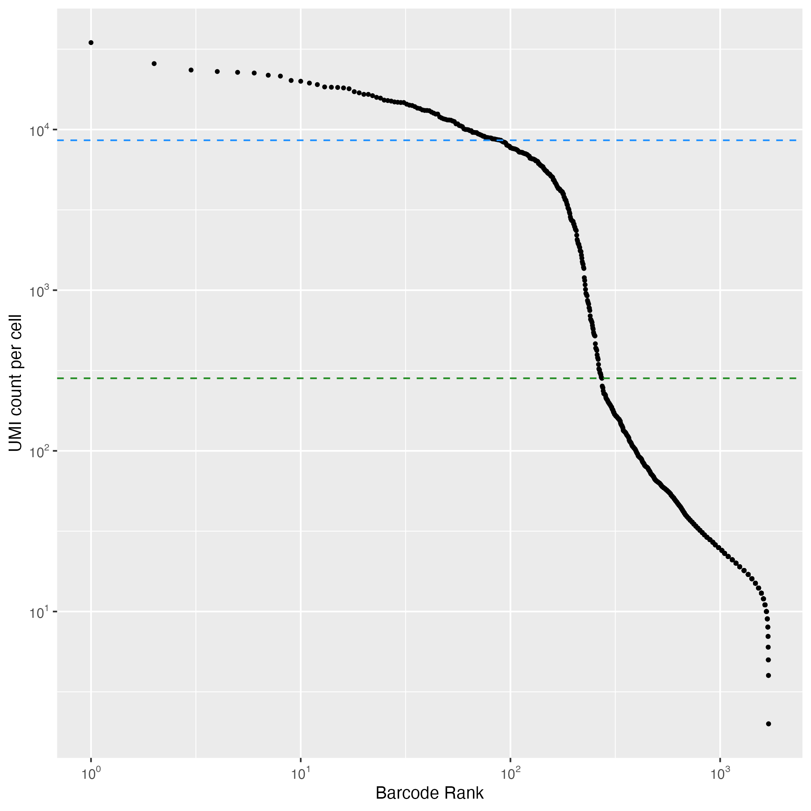

```{r setup, include=FALSE, echo=FALSE, results="hide", message=FALSE}
knitr::opts_chunk$set(echo = TRUE)
library(badger)
```


```{r, echo=FALSE, warning=FALSE ,results='asis'}
cat(
	badge_lifecycle("experimental"),
  badge_devel("JamesOpz/splitRtools", "blue"),
  badge_code_size("JamesOpz/splitRtools"),
  badge_license("MIT")
)
```

# Welcome to the splitRtools package!

## :arrow_double_down: Installation

The package can be installed from this github repository:

```{r install splitRtools, eval =  FALSE}
# Install devtools for github installation if not present
require(devtools)

# download required packages from bioconductor if needed for first install
if (!require("BiocManager", quietly = TRUE))
install.packages("BiocManager")
BiocManager::install(c("zellkonverter", "scater", "ShortRead", "DropletUtils"))

# Install package from github repo
devtools::install_github("https://github.com/TAPE-Lab/splitRtools")

```


## Overview

The splitRtools package is a collection of tools that are used to process SPLiT-seq scRNA-seq data first described in [Rosenberg et.al, 2019](https://www.science.org/doi/10.1126/science.aam8999?url_ver=Z39.88-2003&rfr_id=ori:rid:crossref.org&rfr_dat=cr_pub%20%200pubmed).  </br>
</br>
The splitRtools package is designed to take as input data, the various output files from the [zUMIs package](https://github.com/sdparekh/zUMIs)  ([paper](https://academic.oup.com/gigascience/article/7/6/giy059/5005022?login=true)) for scRNA-seq cell barcode mapping and alignment. </br>
</br>
The zUMIs package takes raw FASTQ output and cell barcoding information, assigning and filteing reads to barcodes. It then maps the cDNA reads to a reference genome using STAR producing a Digital Gene Expression (DGE) matrix, as well as some reporting info about the pipeline.
</br>
</br>
A sample zUMIs pipeline with configuration to work with the Rosenberg-2019 barcode setup is available [here](https://github.com/JamesOpz/split_seq_zUMIs_pipeline). 

## Running the splitRtools pipeline

### Data input directory structure

#### data_folder
The ```splitRtools``` pipeline depends on the naming of the zUMIs pipeline output, this is the variable in the ```.yaml``` config file named ```project:```. All zUMIs outputs for each sublibrary must be contained within a folder with the same name as the zUMI ```project``` name. This is because the project name is embedded into each zUMIs output file. This setting is specified when you run the zUMIs pipeline in the ```project``` parameter in the yaml config file. </br> From the zUMIs pipeline outputs (contained within the location specified in the ```out_dir:``` parameter in the ```.yaml``` config file) you need the zUMIs_output folder, which contains the ```expression```, ```stats``` and barcodes.txt files. As well as the ```project.BCstats.txt``` file. These files need to be organised in the structure outlined below. 
</br>
The folders for each individual sublibrary must be contained withing the ```data_folder``` and this folder's absolute path must be specified in the ```run_split_pipe()``` arguments. </br>

#### File input structure
|</br>
|--```data_folder```</br>
|          |</br>
|          |-```sub_lib_1```</br>
|          |       |-```sub_lib_1.BCstats.txt```</br>
|          |       |-```zUMIs_output```</br>
|          |</br>
|          |-```sub_lib_2```</br>
|          |-```sub_lib_n```</br>


#### Barcode maps
The experiment barcoding layout must be provided as a csv file with two columns - well position (numeric: 1-96) and barcode sequence in each well. Currently ```splitRtools``` supports one barcoding layout for the RT plate (args ```rt_bc```) and another for the two subsequent ligation rounds (args ```lig_bc```). An example of the barcoding layout sheet (Rosenberg 2019 format) is located in this repository in ```data/barcodes_v1.csv```.

#### Sample maps
Similar to the barcoding layout, the sample layout for the RT barcode sample indexing needs to be provided, as ```well_position``` and ```sample_id``` in ```.xlsx``` format. This enables the labeling of each cell with its sample of origin based on it's well position in the RT plate and is specified in the argument ```sample_map```. An example of the sample map layout sheet  is located in this repository in ```data/cell_metadata.xlsx```.

#### Read counts for each sublibrary

You need to specify the read counts for each sublibrary so that the pipeline can determine some of the sublibrary barcode-mapping stats. This must be provided as a dataframe with one column ```sl_name``` identifying the sublibrary name (the zUMIs ```project```) and second column ```reads``` specifying the number of reads per sublibrary. The format is shown in the example below. 

### Executing the pipeline

The splitRtools pipeline is run through the ```run_split_pipe()``` function, which acts as a wrapper to execute the pipeline. A basic setup for the pipeline is as follows: (for more information on pipeline arguments use ```?run_split_pipe```) </br>

```{r run pipe, eval = FALSE}

reads_df =  data.frame(sl_name = c('exp013_p27_s4', 'exp013_p27_s5'), reads = c(1041593427, 1083652637))

# Run the splitRtool pipeline
# Each sublibrary is contained within its own folder in the data_folder folder and must contain zUMIs output, named by sublib name.
run_split_pipe(mode = 'single', # Process each sublibrary seperately
               n_sublibs = 2, # How many to sublibraries are present
               data_folder = "~/path/to/data_folder", # Location of zUMIs data directory
               output_folder = "~/path/to/output_folder", # Output folder path
               filtering_mode = "manual", # Filter by 'knee' (standard) or 'manual' threshold UMI value (default 1000) transcripts
               filter_value = 500, # If filtering mode = "manual" which UMI transcript value to filter at.
               count_reads = FALSE, # Count reads from FASTQ files, if TRUE you must provide a path to FASTQ files (only works with single sublibrarys!)
               total_reads = reads_df, # DataFrame of raw read count per sublibrary
               fastq_path = NA, # Path to folder containing subibrary raw FASTQ if count_reads = TRUE
               rt_bc = "~/path/to_RT_barcode_map/barcodes_v2_48.csv", # RT barcode map
               lig_bc = "~/path/to_ligation_barcode_map/barcodes_v1.csv", # Ligation barcode map
               sample_map = "~/path/to_RT_sample_layout_map/exp013_cell_metadata.xlsx" # RT sample-well mapping plate layout file
)
```


## Pipeline outputs

### Output directory structure 
|</br>
|--```output_folder```</br>
          |</br>
          |-```sub_lib_1```</br>
          |       |-```unfiltered_sce_h5ad_objects```</br>
          |       |-```filtered_sce_h5ad_ojects```</br>
          |       |-```ggplot_outputs```</br>
          |       |-```report_data_outputs```</br>
          |</br>
          |-```sub_lib_2```</br>
          |-```sub_lib_n```</br>
          |-```merged_sublibrary_data```</br>


### Output data

The first stage of the pipeline labels converts the DGE count matrix into a ```SingleCellExperiment``` object and labels each cell with various ```ColData``` interpreting the cell barcode into a series of well IDs based each stage of the barcoding process and the correspondence between the RT wells ID and the ```sample_map``` .xlsx file provided. This data is then stored as an ```SCE``` or an ```.h5ad``` object in ```unfiltered/``` output folder for each sublibrary.</br>
</br>
The ```SingleCellExperiment``` object is then filtered based in either a manual cutoff of UMI per cell or using the ```DropletUtils``` package knee filtering threshold depending on the setting of the ```filter_mode``` and ```filter_value``` (only used for manual filtering) arguments. The SCE and a corresponding .h5ad object are stored in in the ```filtred/``` output folder for each sublibrary.</br> 

### Diagnostic plots

The splitRtools pipeline will generate a set of diagnostic plots in order to evaluate the initial quality of the SPLiT-seq scRNA-seq data and barcoding process. Thesea are saved in the ```gplots/``` output folder. </br>
</br>
After labeling the data is filtered using either the ```DropletUtils``` package spline-fitting functionality or a user specified manual cutoff of transcripts. This produces the following waterfall plot along with quantifiaction of the cell types recovered by sample: </br>
</br>

</br>   
</br> 
The barcoding cell data is then mapped to the respective plate locations across the 3 barcoding rounds to provide a series of heatmaps displaying cells recovered per well and median UMI per cell per well across the RT1, L2 and L3 plates:
</br>

