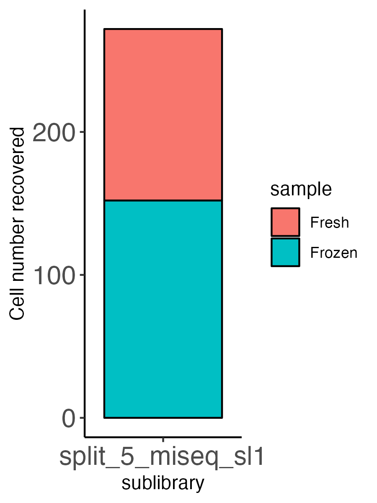
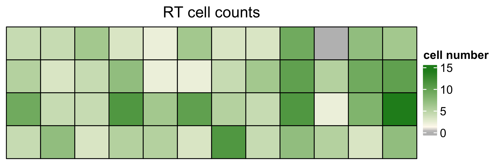
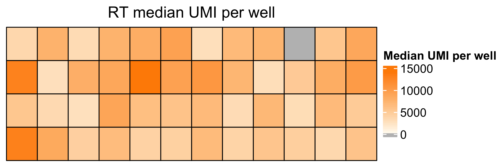

README
================
james\_opzoomer
26/04/2022

# Welcome to the splitRtools package\!

## This package is under active development and all functionality is not yet validated\!\!

## The package may change significantly over development

## Installation

The package can be installed from this github repository:

``` r
# Install devtools for github installation if not present
require(devtools)

# Install package from github repo
devtools::install_github("https://github.com/JamesOpz/splitRtools")
```

## Overview

The splitRtools package is a collection of tools that are used to
process SPLiT-seq scRNA-seq data ([Rosenberg
et.al, 2019](https://www.science.org/doi/10.1126/science.aam8999?url_ver=Z39.88-2003&rfr_id=ori:rid:crossref.org&rfr_dat=cr_pub%20%200pubmed)).
</br> </br> The splitRtools package is designed to take as input data,
the output from the [zUMIs package](https://github.com/sdparekh/zUMIs)
([paper](https://academic.oup.com/gigascience/article/7/6/giy059/5005022?login=true)).
The zUMIs package is used to take raw FASTQ output, assign and filter
reads to barcodes and map reads to the reference genome producing a
cellxcount matrix, as well as some reporting about the pipeline outputs.
</br> </br> A sample zUMIs pipeline with configuration to work with the
Rosenberg-2019 barcode setup is available
[here](https://github.com/JamesOpz/split_seq_zUMIs_pipeline).

## Running the splitRtools pipeline

### Data input directoruy structure

### Executing the pipeline

The splitRtools pipeline is run through the `run_split_pipe()` function,
which acts as a wrapper function to execute the pipeline. A basic setup
for the pipeline is as follows: </br>

``` r
# Load splitRtools
library(splitRtools)

# Run the splitRtool pipeline
# You must always point to two parent folders containing sublibrary raw FASTQ folders
# Each sublibrary is within this folder and must contain zUMIs output
run_split_pipe(mode = 'merge', # Merge sublibraries or process seperately
               n_sublibs = 2, # How many to sublibraries are present
               data_folder = "./../test_data_sp_5_miseq/", # Location of zUMIs data directory
               output_folder = "../test_data_sp_5_miseq_outputs/", # Output folder path
               filtering_mode = "knee", # Filter by knee (standard) or manual value (default 1000) transcripts
               fastq_path = "../fastq_single/", # Path to folder containing subibraru raw FastQ
               rt_bc = "../test_data_sp_5_miseq/barcodes_v1.csv", # RT barcode map
               lig_bc = "../test_data_sp_5_miseq/barcodes_v1.csv", # Ligation barcode map
               sample_map = "../test_data_sp_5_miseq/cell_metadata.xlsx" # RT plate layout file
)
```

## Pipeline outputs

### Output directory structure

### Output data

The first stage of the pipeline labels converts the cell count matrix
into a `SingleCellExperiment` object and labels each cell with various
`ColData` with a series of well IDs based each stage of the barcoding
process and the correspondence between the RT wells and the on the
`sample_map` excel file provided. This data is then stored as an `SCE`
or an `annData` object in `unfiltered/` output folder for each
sublibrary.</br> </br>

### Diagnostic plots

The splitRtool pipeline will generate a set of diagnostic plots in order
to evaluate the initial quality of the SPLiT-seq scRNA-seq data. </br>
</br> After labeling the data is filtered using either the
`DropletUtils` package spline-fitting functionality or a user specified
cutoff of transcripts. This produces the following waterfall plot along
with quantifiaction of the cell types recovered by sample: </br> </br>

</br>  
</br> The barcoding cell data is then mapped to the respective plate
locations across the 3 barcoding rounds to provide a series of heatmaps
displaying cells recovered per well and median UMI per cell across all
wells: </br>

